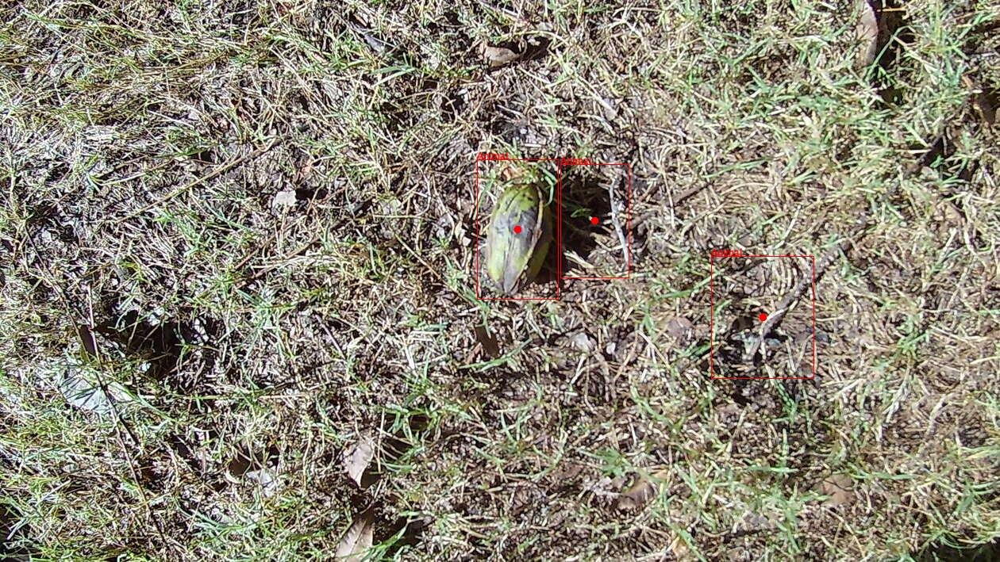

# pecan-finder

A test of the Google Cloud Vision object localizer API to
see if it might be able to detect pecans.



See <https://cloud.google.com/vision/docs/object-localizer>

## Install
Add the following dependency to your `project.clj` file:

    [pecan-finder "0.1.0-SNAPSHOT"]

## Credentials

Follow link to set up credentials, billing, etc...

<https://cloud.google.com/vision/docs/setup>

You'll need credentials to make api calls. These can be specified via
an environment variable where `[PATH]` is the path to the json
credentials for a particular google project.  This is the project
where any charges will be accounted for.

``` shell
export GOOGLE_APPLICATION_CREDENTIALS="[PATH]"
```

Note, in MacOS, the export command needs to be invoked from zsh.
Place the `export` command in a `~/.zshenv`.  Invoke using `source`.

``` shell
source ~/.zshenv
```

## Usage

``` clojure
(annotate-image-as-maps "20200901_120343.JPG")
(annotate-image-with-crop-hints "20200901_120343.JPG")
(annotate-image-with-obj-localization "20200901_120343.JPG")

```


## License

Copyright © 2022 Bill Winkler

This program and the accompanying materials are made available under the
terms of the Eclipse Public License 2.0 which is available at
http://www.eclipse.org/legal/epl-2.0.

This Source Code may also be made available under the following Secondary
Licenses when the conditions for such availability set forth in the Eclipse
Public License, v. 2.0 are satisfied: GNU General Public License as published by
the Free Software Foundation, either version 2 of the License, or (at your
option) any later version, with the GNU Classpath Exception which is available
at https://www.gnu.org/software/classpath/license.html.
