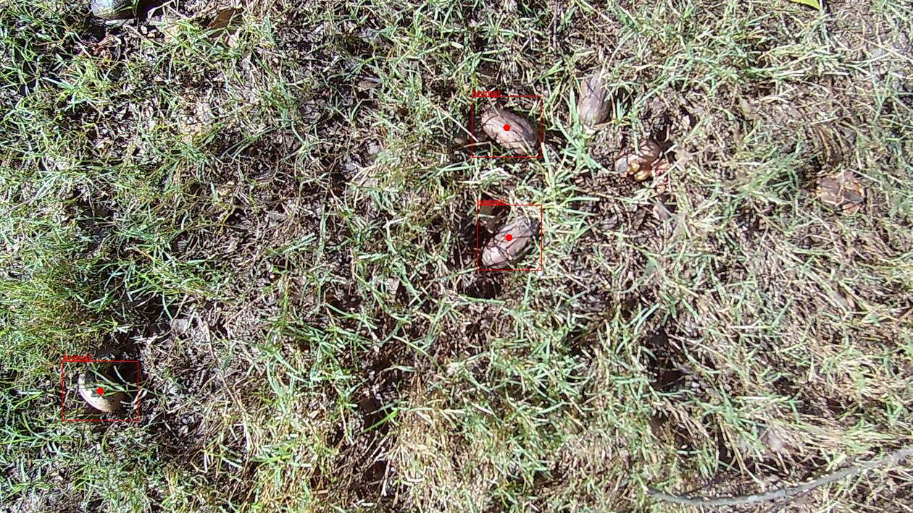

# pecan-finder

A test of the Google Cloud Vision object localizer API to
see if it might be able to detect pecans.



See <https://cloud.google.com/vision/docs/object-localizer>

## Install
Add the following dependency to your `project.clj` file:

    [pecan-finder "0.1.0-SNAPSHOT"]

## Credentials

Follow link to set up credentials, billing, etc...

<https://cloud.google.com/vision/docs/setup>

You'll need credentials to make api calls. These can be specified via
an environment variable where `[PATH]` is the path to the json
credentials for a particular google project.  This is the project
where any charges will be accounted for.

``` shell
export GOOGLE_APPLICATION_CREDENTIALS="[PATH]"
```

Note, in MacOS, the export command needs to be invoked from zsh.
Place the `export` command in a `~/.zshenv`.  Invoke using `source`.

``` shell
source ~/.zshenv
```

## Usage

``` clojure
(annotate-image-as-maps "20200901_120343.JPG")
(annotate-image-with-crop-hints "20200901_120343.JPG")

;; first create a "results" directory to store annotated images
(annotate-image-with-obj-localization "20200901_120343.JPG")

```

## Object Localization

To annotate an image and display the result in a JFrame.

``` clojure
(annotate-image-with-obj-localization "20200901_120611.JPG" :show true) 
```

Returns a list of any object annotations that were found.
``` clojure
({:file "20200901_120611.JPG",
  :objs
  [{:label "Animal", :x 712, :y 212, :w 117, :h 192}
   {:label "Animal", :x 688, :y 49, :w 208, :h 97}
   {:label "Animal", :x 555, :y 343, :w 125, :h 123}
   {:label "Animal", :x 595, :y 135, :w 77, :h 117}
   {:label "Animal", :x 499, :y 223, :w 113, :h 81}
   {:label "Animal", :x 551, :y 467, :w 88, :h 173}
   {:label "Animal", :x 1035, :y 561, :w 85, :h 99}
   {:label "Bird", :x 713, :y 211, :w 113, :h 189}
   {:label "Moths and butterflies", :x 688, :y 51, :w 205, :h 92}]})
```

Annotate all images and store the localization results.

``` clojure
(require '[pecan-finder.tryit :as run])
(spit "results/results.edn" (seq (run/annotate-images!)))

```

Results

``` clojure
;; Number of images with zero annotations (23 of 129)
(let [r (->> "results/results.edn" slurp read-string)]
      (->> r (map (comp :objs first)) (filter empty?) count))

;; Summary of annotations found
(let [r (->> "results/results.edn" slurp read-string)]
      (->> r (map (comp :objs first)) (remove empty?) flatten (map :label) frequencies)) 
      
{"Bird" 6,
 "Turtle" 4,
 "Fruit" 2,
 "Animal" 373,
 "Shoe" 17,
 "Insect" 6,
 "Watermelon" 2,
 "Footwear" 9,
 "Flower" 1,
 "Tick" 1,
 "Moths and butterflies" 7,
 "Isopod" 1,
 "Mushroom" 5,
 "Snail" 1}
 
 ;; Find images having a specific annotation, for example a Tick
 (let [r (->> "results/results.edn" slurp read-string)
                               fltr (fn [obj] (some #(= "Tick" (:label %)) (:objs obj)))]
                           (->> r (map first) (filter fltr)))
                           
({:file "20200901_120343.JPG",
  :objs [{:label "Tick", :x 631, :y 321, :w 97, :h 99}]})                           
```

## Annotation Test Results

About half of the pecans (52%) were annotated as something.  Of those annotations, 98% were labeled as "Animal".  But other things, like leaves, sticks and branches were also identified as being "Animal[s]".  About one third of the objects annotated as "Animal" were pecans.

| Metric  | Value   |
|:--|:--|
| Number of Images  | 129  |
| Out of Focus Images  | 19  |
| Total Pecans  | 244 |
| % of Pecans Annotated as Something | 56%  |
| # of Pecans Annotated as Two Different Types | 6  |
| Number of Annotated Objects  | 418  |
| % "Animal" as Pecan Annotation  | 93%  |
| Number of Objects Annotated as Animals  | 380  |
| % of Animal Annotations That Were Pecans  | 34%  |
| % of Animal Annotations That Were Leaves  | 50%  |
| % of Annotated Objects Identified as Animals  | 91%  |

The [test result spreadsheet](https://docs.google.com/spreadsheets/d/1QuZcuINqm1jCDHDSkN5jG_lq2Fb-UZ7Krf5aHFIc5yc/edit?usp=sharing).


## License

Copyright © 2022 Bill Winkler

This program and the accompanying materials are made available under the
terms of the Eclipse Public License 2.0 which is available at
http://www.eclipse.org/legal/epl-2.0.

This Source Code may also be made available under the following Secondary
Licenses when the conditions for such availability set forth in the Eclipse
Public License, v. 2.0 are satisfied: GNU General Public License as published by
the Free Software Foundation, either version 2 of the License, or (at your
option) any later version, with the GNU Classpath Exception which is available
at https://www.gnu.org/software/classpath/license.html.
